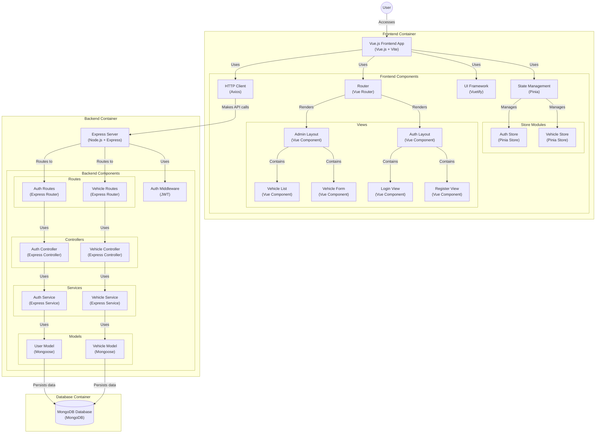

# Vehicle Management System

Este proyecto es una aplicación web SPA que permite a los usuarios administradores autenticados registrar y visualizar vehículos en el contexto de una empresa de ride hailing.


## Requisitos

- Node.js v18.20.4
- MongoDB

## Configuración

### Seleccionar la version de node

   ```bash
      nvm use
   ```

   en algunos sistemas operativos puede necesitar especificar la version, si fuera el caso

   ```
      nvm use v18.20.4
   ```


### Clonar el Repositorio
git clone https://github.com/angelzabala/ridehailing-test.git

### Configurar el Backend

1. Navega al directorio del backend:

   ```bash
   cd backend
   ```

2. Instala las dependencias:

   ```bash
   npm install
   ```

3. Configura las variables de entorno en un archivo `.env` (en desarrollo local no es necesario):

   ```plaintext
   PORT=3000
   MONGODB_URI=mongodb://127.0.0.1:27017/vehicle-management
   JWT_SECRET=ejemplo_de_jwt
   ```

4. Ejecuta el script de seeder para poblar la base de datos:

   ```bash
   node ./database/seeder.js
   ```

5. Iniciar el servidor:

   ```bash
   npm run dev
   ```

### Configurar el Frontend

es importante que uses el nvm correcto en ambas consolas. 

1. Navega al directorio del frontend:

   ```bash
   cd ../frontend
   ```

2. Instala las dependencias:

   ```bash
   npm install
   ```

3. Configura las variables de entorno en un archivo `.env` (en desarrollo local no es necesario):

   ```plaintext
   VITE_API_URL=http://localhost:3000/api 
   ```


4. Inicia el servidor de desarrollo:

   ```bash
   npm run dev
   ```

## Uso

- Accede a la aplicación en `http://localhost:5173`.
- Regístrate o inicia sesión con las credenciales de prueba.  
- Administra los vehículos desde la interfaz de usuario.

## Usuarios de prueba 
      
```plaintextv
      - { email: "admin@example.com", password: password123 }
      - { email: "user1@example.com", password: password123 }
      - { email: "user2@example.com", password: password123 }
```

## Detalles del Proyecto

- **Frontend**: Desarrollado con Vue.js 3 y Vuetify.
- **Backend**: Desarrollado con Node.js, Express y MongoDB.
- **Autenticación**: Implementada con JWT.
- **Base de Datos**: MongoDB con Mongoose para la gestión de esquemas.

## Despliegue

Para desplegar el proyecto en producción, asegúrate de configurar las variables de entorno adecuadas y utiliza un servicio de alojamiento compatible con Node.js y MongoDB.
Por motivos laborales y de estudio no se hizo el despliegue en ninguna plataforma.

## Diagráma de arquitectura



## Contribuciones

Las contribuciones son bienvenidas. Por favor, abre un issue o un pull request para discutir cambios.

## Licencia

Este proyecto está bajo la Licencia MIT.
