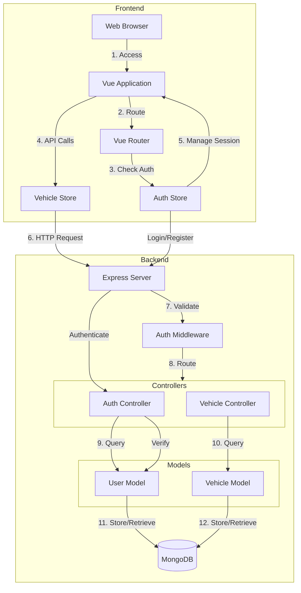

```mermaid
graph TD
    subgraph Frontend
        Browser["Web Browser"]
        VueApp["Vue Application"]
        AuthStore["Auth Store"]
        VehicleStore["Vehicle Store"]
        Router["Vue Router"]
    end

    subgraph Backend
        Express["Express Server"]
        AuthMiddleware["Auth Middleware"]
        
        subgraph Controllers
            AuthController["Auth Controller"]
            VehicleController["Vehicle Controller"]
        end
        
        subgraph Models
            UserModel["User Model"]
            VehicleModel["Vehicle Model"]
        end
        
        MongoDB[(MongoDB)]
    end

    %% Frontend Flow
    Browser -->|"1. Access"| VueApp
    VueApp -->|"2. Route"| Router
    Router -->|"3. Check Auth"| AuthStore
    VueApp -->|"4. API Calls"| VehicleStore
    AuthStore -->|"5. Manage Session"| VueApp

    %% Backend Flow
    VehicleStore -->|"6. HTTP Request"| Express
    Express -->|"7. Validate"| AuthMiddleware
    AuthMiddleware -->|"8. Route"| Controllers
    AuthController -->|"9. Query"| UserModel
    VehicleController -->|"10. Query"| VehicleModel
    UserModel -->|"11. Store/Retrieve"| MongoDB
    VehicleModel -->|"12. Store/Retrieve"| MongoDB

    %% Authentication Flow
    AuthStore -->|"Login/Register"| Express
    Express -->|"Authenticate"| AuthController
    AuthController -->|"Verify"| UserModel
```